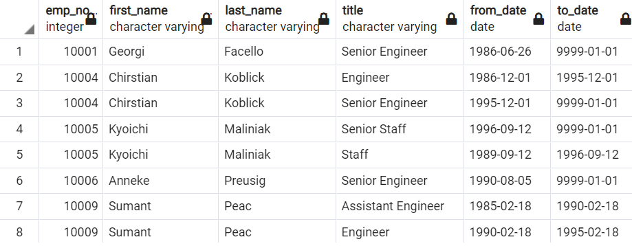
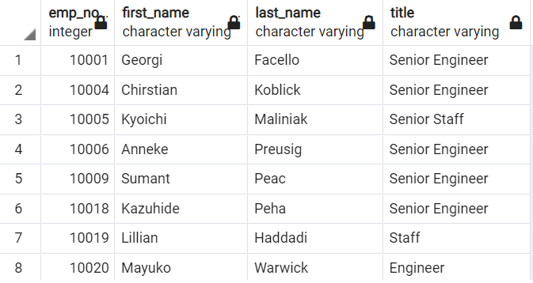
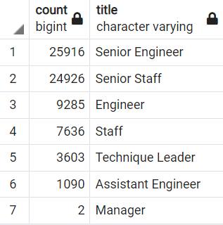
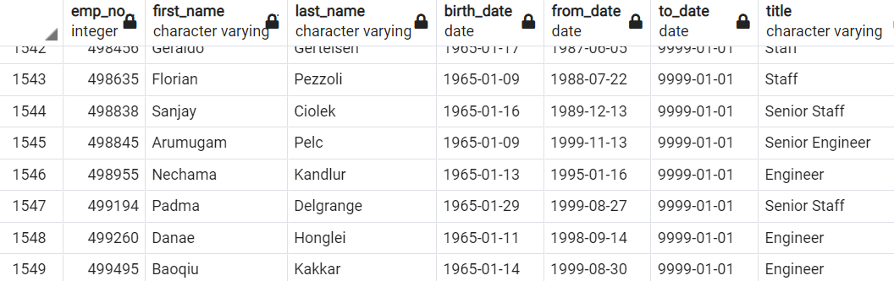
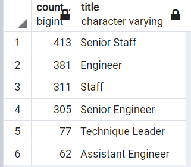

# Pewlett-Hackard-Analysis
Pewlett Hackard is a large company with thousands of employees, the company is looking for the future. First, it is offering a retirement package for ones to achieve the criteria, and second, which position will need in each area in the near future.

## Overview of Project 
### Purpose 
The purpose of this analysis is to figure out wich employees will achieve the criteria and can be part of the mentorship program, also to identify the number of employees that wiil be needed by title. This will  be necessary for the company to determine the strategies to always  has the vacances full and competitive employees througth the years. 

## Results 

*Is possible to visualize that there are employees twice, same ID but different from_date and to_date this is because they change their position throughout the years, the different titles confirmed they received a promotion.

*Even filtered by the last title, there are more than 4,000 employees that born between 1952 and 1955, ready to retire the near years, this means lots of vacances to fill. Starting with the recrutment strategies will be necessary.

*As we see, the title Senior Engineer has 25,916 employees ready to retire, then Senior Staff have 24,926, these are the most impact title retirement that the company has. There are other 5 titles included in this list but fewer employees than the first two.

*There are 1,549 employees that satisfy the criteria to be part of the mentorship program, different titles that will help to train the new employees to be competitive workers. 

### Summary

-How many roles will need to be filled as the "silver tsunami" begins to make an impact?
----
After a deep analysis, will be necessary 63,173 included seven different titles that are: 'Senior Engineer' with 25,916 vacances, 'Senior Staff' with 24,926 Vacances, 'Engineer' with 9,285 Vacances, 'Staff' with 7,636 Vacances, 'Technique Leader' with 3,603 vacances, 'Assistant Engineer' with 1,090 Vacances and 'Manager' with 2 vacances. 

-Are there enough qualified, retirement-ready employees in the departments to mentor the next generation of Pewlett Hackard employees?
---

Using the next query:
   
    SELECT COUNT (title) as count, title
    FROM mentorship_elegibility
    GROUP BY title
    ORDER BY count DESC

Output the next table

comparing with

There are not retirement-ready employees with the title manager, there are 305 employees with the title 'Senior Engineer', 413 employees with the title 'Senior Staff', 381 employees with the title 'Engineer', 311 employees with the title 'Staff', 77 employees with the title 'Technique Leader' and 62 employees with the title 'Assistant Engineer.' Talking about only the 'Senior Engineer' there will be only 2% of retirement-ready employees in the department to a mentor of the department vacances. This means the mentorship won´t be enough to train all the new employees in each department. 
